https://paperswithcode.com/sota/audio-classification-on-esc-50
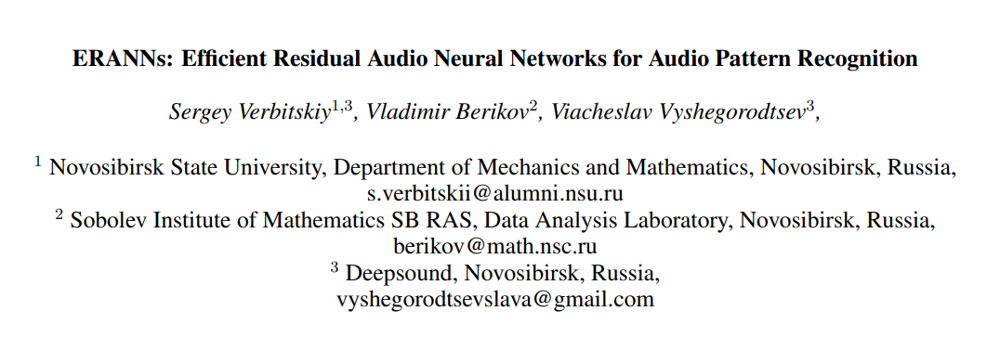

Proposer: 李彥霖

[TOC]

 

## Paper Do
1. Propose convolutional neural network frameworks improving the inference speed of CNN-based systems.
2. Investigate the impact of **(1)data augmentation techniques** ,and **(2) transfer learning**.

## Audio pattern recognition (APR )
- Environmental sound classification(環境聲音分類)
- Sound event detection(聲音事件檢測)
- Audio tagging(音頻標記)
- Smart room monitoring(智能房間監控)
- Video content highlight generation(視頻內容突出顯示生成)
- Musical genre classification(音樂類型分類)
- Speech emotion classification(語音情感分類)
- Classify respiratory diseases(分類呼吸系統疾病)

## Related work
### Traditional Methods
Traditional APR systems are classical generative or discriminative models, e.g., (1)**Gaussian mixture models(GMMs)**, and used (2)time-frequency representations: **log mel spectrogram** or **mel-frequency cepstral coefficients (MFCCs)** as input.\
Methods with neural networks, in particular with **CNNs**, significantly **outperformed conservative machine learning** methods for APR tasks. \
**CNN-based** systems **outperformed** recurrent neural network **(RNN)-based** systems.

  
   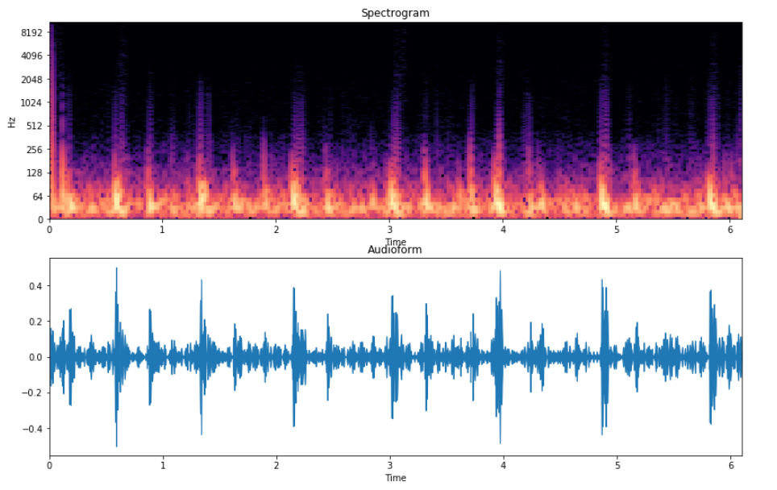   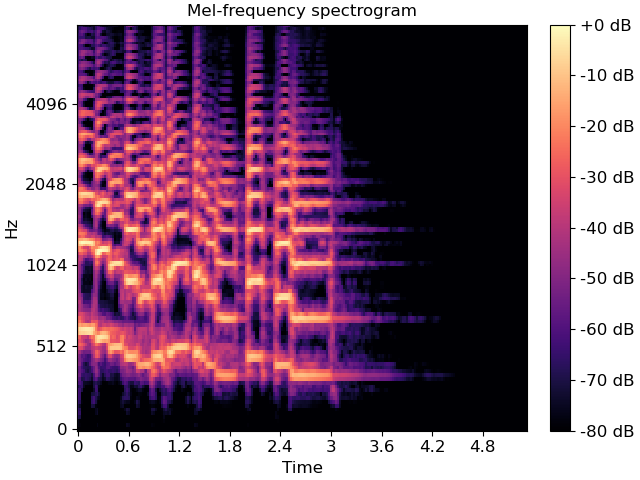 
 
Left top:spectrogram, left bottom:time-domain sigal,  right:mel spectrogram
  

> (GMMs)“An MFCC-GMM approach for event detection and classification,” in IEEE Workshop on Applications of Signal Processing to Audio and Acoustics (WASPAA), 2013.\  
> (CNNs)“Learning from Between-class Examples for Deep Sound Recognition,” in International Conference on Learning Representations, 2018.  \
> (CNNs)“PANNs: Large-Scale Pretrained Audio Neural Networks for Audio Pattern Recognition,” IEEE/ACM Transactions on Audio, Speech, and Language Processing,  2020. (CNNs) \
> (CNNs vs. RNNs)“A comparison of Deep Learning methods for environmental sound detection,” in 2017 IEEE International Conference on Acoustics, Speech and Signal Processing (ICASSP), 2017  ,

### Transformer-based systems
A **transformer-based** system achieves the state-of-the-art performance with an **mAP of 0.485** on the AudioSet dataset.\
However, **high computational complexity** (526.6 million parameters), which makes it difficult to apply this system in real life.
> Y. Gong, Y.-A. Chung, and J. Glass, “AST: Audio Spectrogram Transformer, 2021, MIT Computer Science and Artificial Intelligence Laboratory, Cambridge”

### CNN-based systems
1. Use models with **2D convolutional layers** and **time–frequency representations**, e.g., the log **mel spectrogram**, as **input** to the first 2D convolutional layer.
2. **End-to-end systems**, where the raw audio signal is used as input. comprise two parts.
    1. First part includes **1D convolutional layers**, applied to extract 2D features, which replace time– frequency representations.
    2. Fedd features from previous step to 2D convolutional layers.

Systems with the **log mel spectrogram** perform **better** on APR tasks.\
Moreover, there are end-to-end systems, which contain only 1D convolutional layers .

### Transfer learning
A model is trained for **tasks with a large dataset** and transferred to **similar tasks with smaller datasets**: all parameters of the **model** for the new task are **initialized from the pre-trained model**, except parameters of few last layers.

In this article, we use **fine-tuning** as the transfer learning strategy (we **optimize all parameters** of transferred models)
<!-- 

使用大型數據集的任務培訓模型，並將其傳輸到具有較小數據集的類似任務：新任務模型的所有參數都是從預先訓練的模型初始化的,除了最後幾層參數。在autioset數據集上預先培訓的型號將傳輸到其他三個APR任務，其中包含小型數據集：ESC-50，UrbanSound8k和Ravdess。
-->
### Residual neural network(殘差神經網絡)
**Residual neural networks (ResNets)** have **shortcut connections** among convolutional layers, which help partially avoid the **vanishing gradient** problem. 

**WideResNets** have an additional hyperparameter—the **widening factor(擴大因子)** for the width of convolutional layers—to change the **computational complexity** of models. With optimal values of the widening factor, WideResNets have **better performance** and **fewer parameters** than original ResNets.

This paper use **shortcut connections** **and** the **widening factor** in CNN architecture.

## Methods

#### Hyperparameters
- Log-Mel spectrogram
    - **sampling rate**: 44.1k Hz
    - (STFT) with the Hann **window of size**: 1380 (≈ 31 ms)
    - **hop size** : 345 (≈ 8 ms)
    - $T_s = 128t$, where $T_s$ is number of time frame, and $t$ is the time duration(sec).
    - **Mel bin** : 128,  which is the best choice as a trade-off between **computational complexity** and **performance** of models.
    - $f_{min} = 50 Hz$ ,   lower cut-off frequency (remove low-frequency noise)
    - $f_{max} = 14000 Hz$,  upper cut-off frequency  (remove the aliasing effect)

#### ERANNs Architecture
Log mel spectrogram is 2D tensor with a shape of 128 ×$T_s$.\
Each tensor between CNN blocks has a shape of $F_i ×T_i ×C_i$, where $F_i$ is “the i-th frequency size”, $T_i$ is “the ith temporal size” and $C_i$ is the number of channels.\
$s_m$ is the **decreasing temporal size parameter.** **Temporal sizes $T_i$ are reduced stronger** based on **increased stride sizes** of convolutional layers.\
$W$ is the widening factor and $s_i$ are stride sizes.

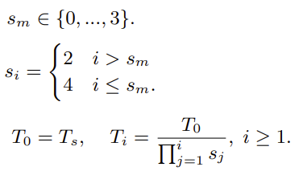
 

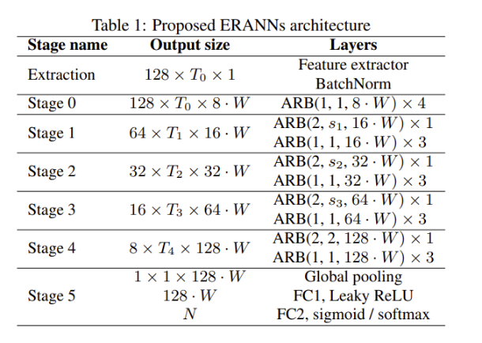
 

#### Audio Residual Block(ARB)

$ARB(x, y, c)$ where $x$ is the **stride size for the frequency dimension**, $y$ is the **stride size for the temporal dimension**, and $c$ is the **number of output channels**.

$K_1(z)$,$K_2(z)$,and $P(z)$ for ARBs, where $z$ is the **stride size**, are defined as

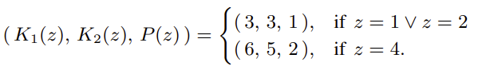
 

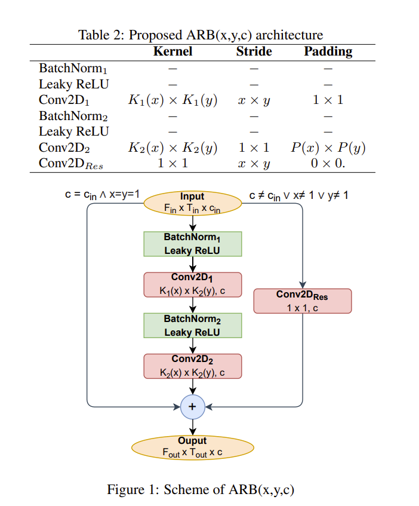
 

- Global pooling:  use a sum of average and max pooling to combine their advantages.
- fully connected layers, FC1 and FC2
    - **softmax for sound classification** tasks
    - **sigmoid for audio tagging** tasks at the end to obtain predictions.

##### Leaky ReLU
**Leaky ReLU** with parameter 0.01 is applied as a replacement for ReLU because the use of ReLU can lead to the **dying ReLU problem**.
  
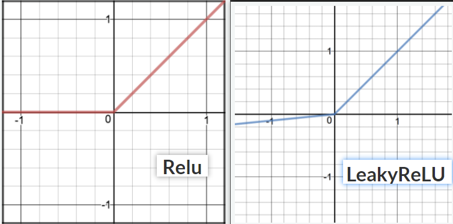
 

## Experiment

- Adam optimizer , cross-entropy loss, and a mini-batch size of 32.
- For the AudioSet dataset,use **One-cycle learning rate policy** with a maximum **learning rate of 0.001**.
- For ESC50, UrbanSound8K, and RAVDESS, we use a constant **learning rate of 0.0002 for training from scratch** and a constant **learning rate of 0.0001 for fine-tuning.**

#### AudioSet 
- A large-scale audio dataset. The dataset includes over 2 million audio recordings with 527 sound classes and the duration of most audio clips is **10 seconds.** 
- A **multilabel dataset** (tagging task). **Sigmoid** is used to obtain predictions of models.
- Use a balanced sampling strategy from *PANNs: Large-Scale Pretrained Audio Neural Networks for Audio Pattern Recognition*.

##### AudioSet: Impact of Data Augmentation Techniques

Each system with fixed values of hyperparameters is abbreviated as **ERANN-sm-W**, where sm is the **decreasing temporal size parameter** and **W is the widening factor**.\
mixup type:
- 1 training without mixup 
- 2 standard mixup on the waveform
- 3 modified mixup on the waveform
- 4 modified mixup on the log mel spectrogram

$t_c$ is duration of cropped sections of training audio.

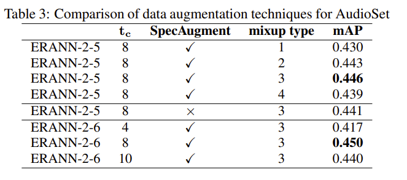
 

##### AudioSet: Impact of Hyperparameters 
Each system with fixed values of hyperparameters is abbreviated as **ERANN-sm-W**, where sm is the **decreasing temporal size parameter** and **W is the widening factor**.

 

Increasing $s_m$ reduces FLOPs and increases the inference speed of models because tensors between convolutional layers have fewer sizes.

##### AudioSet: result

Each system with fixed values of hyperparameters is abbreviated as **ERANN-sm-W**, where sm is the **decreasing temporal size parameter** and **W is the widening factor**.

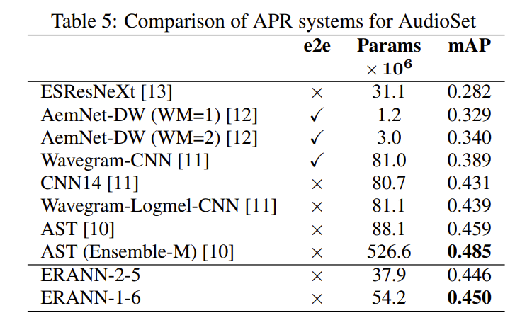
 

AST was pre-trained on ImageNet , ERANN-5 system is trained from scratch.

#### ESC-50
Environmental Sound Classification, comprising 50 sound classes and 2000 5-second audio recordings. This dataset is balanced with 40 audio recordings per sound class.

##### ESC-50: Impact of Hyperparameters and AudioSet Pre-training
Each system with fixed values of hyperparameters is abbreviated as **ERANN-sm-W**, where sm is the **decreasing temporal size parameter** and **W is the widening factor**.

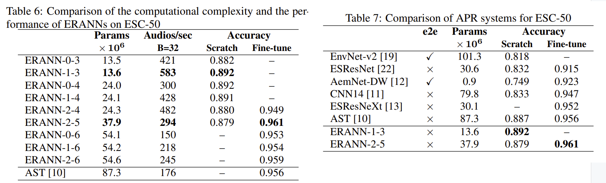
 

#### UrbanSound8K
The UrbanSound8K dataset includes **8,732 audio clips** with **10 classes** of urban sounds. Audio signals have various durations, which do **not exceed 4 seconds.**

##### UrbanSound8K Results
Each system with fixed values of hyperparameters is abbreviated as **ERANN-sm-W**, where sm is the **decreasing temporal size parameter** and **W is the widening factor**.

Not employ the **temporal cropping** because the duration of audio signals significantly varies ( **from 0.05 to 4 seconds** )

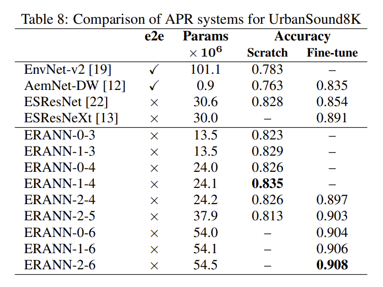
 

#### RAVDESS
The RAVDESS dataset includes **speech and song recordings** of **24 professional** actors with **eight diverse emotions.**\
We use the speech set that comprises **1440 audio recordings** with an average duration of **4 seconds.**

Augmentation: for RAVDESS, we use **modified mixup on the waveform**, the **temporal cropping** (tc = 3), and **SpecAugment** during training. We also use **pitch shifting(音高移位).**

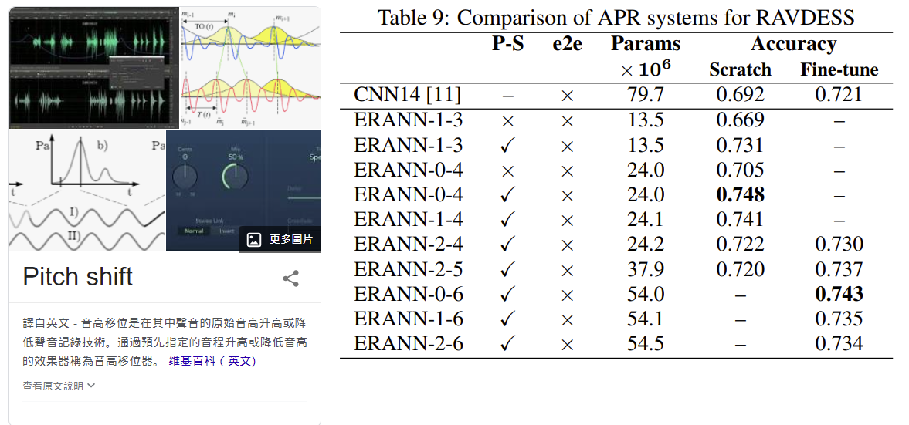
 

Pre-training on the AudioSet dataset does not improve the performance of systems on RAVDESS.\
ERANNs with $s_m$ > 0 have worse performance than ERANNs with $s_m$ = 0.

## Conclusion

